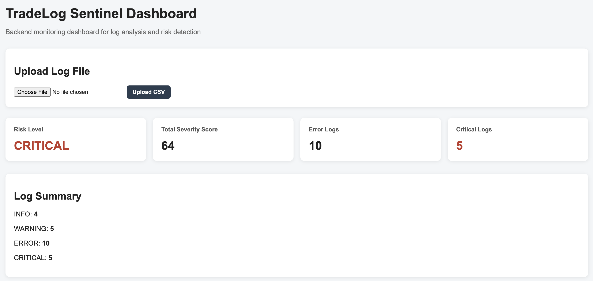
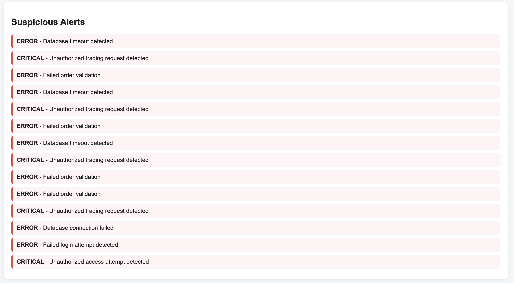
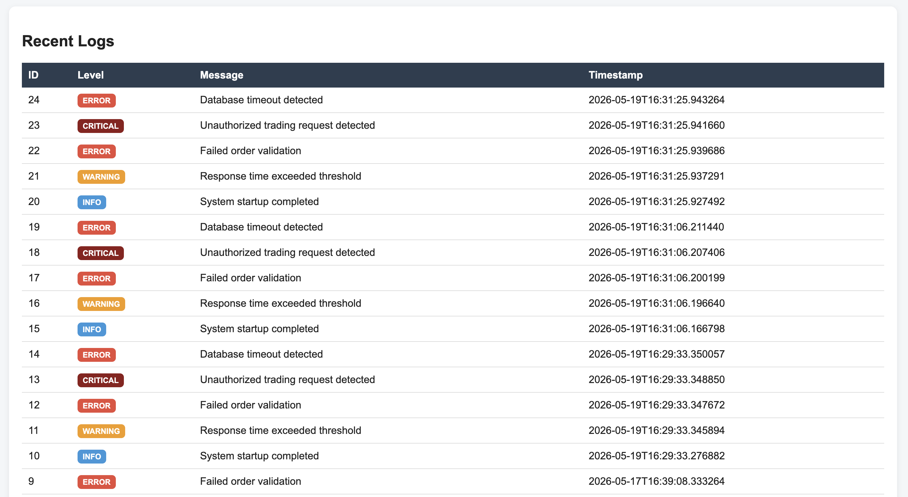

# TradeLog Sentinel

Backend monitoring and log analysis platform built with Spring Boot, PostgreSQL, and Thymeleaf.

TradeLog Sentinel analyzes operational log data, detects suspicious events, calculates monitoring risk levels, and visualizes results through a dashboard interface.

---

# Project Background

TradeLog Sentinel was inspired by enterprise-style operational monitoring systems commonly used in large-scale backend environments.

While working in enterprise development environments, I became interested in how backend systems process logs, monitor operational events, and identify suspicious activities through automated analysis.

This project was created to explore backend engineering concepts such as:

- log processing
- CSV ingestion workflows
- risk analysis
- alert generation
- dashboard visualization
- database-driven monitoring systems

The goal of this project is not to recreate a real financial system, but to build a simplified backend monitoring platform using modern Java backend technologies.

---

# Tech Stack

| Area | Technology |
|---|---|
| Backend | Java 17 |
| Framework | Spring Boot |
| Database | PostgreSQL |
| ORM | Spring Data JPA / Hibernate |
| Frontend | Thymeleaf |
| Build Tool | Maven |
| Version Control | Git / GitHub |

---

# Features

| Feature | Description |
|---|---|
| CSV Log Upload | Upload CSV log files directly from the dashboard |
| Log Persistence | Store parsed logs in PostgreSQL |
| Risk Analysis | Calculate dynamic monitoring risk levels |
| Severity Scoring | Generate total severity scores |
| Suspicious Alert Detection | Detect ERROR and CRITICAL events |
| Monitoring Dashboard | Visualize logs and risk summaries |
| Log Summary | Count INFO, WARNING, ERROR, and CRITICAL logs |
| Timestamp Tracking | Automatically store event timestamps |

---

# System Architecture

```text
CSV Upload
   ↓
Spring Boot Controller
   ↓
Log Service Layer
   ↓
Risk / Alert Detection Logic
   ↓
Spring Data JPA Repository
   ↓
PostgreSQL Database
   ↓
Thymeleaf Monitoring Dashboard
```

---

# Dashboard Preview

## Dashboard Overview



---

## Suspicious Alerts



---

## Recent Logs



---

# Sample CSV Format

```csv
INFO,System startup completed
WARNING,Response time exceeded threshold
ERROR,Failed order validation
CRITICAL,Unauthorized trading request detected
ERROR,Database timeout detected
```

---

# API Endpoints

| Method | Endpoint | Description |
|---|---|---|
| GET | `/api/test` | Test API status |
| POST | `/api/logs` | Create a log entry |
| GET | `/api/logs` | Retrieve all logs |
| POST | `/api/logs/upload` | Upload CSV log file |
| GET | `/api/logs/risk` | Get risk analysis |
| GET | `/api/logs/summary` | Get log summary |
| GET | `/api/logs/alerts` | Get suspicious alerts |
| GET | `/api/logs/recent-alerts` | Get recent suspicious alerts |
| GET | `/api/logs/severity-score` | Get total severity score |
| GET | `/dashboard` | Open monitoring dashboard |

---

# How To Run

## Clone Repository

```bash
git clone <repository-url>
cd tradelog-sentinel
```

## Configure Database

Example `application.properties`

```properties
spring.datasource.url=jdbc:postgresql://localhost:5432/tradelog
spring.datasource.username=your_username
spring.datasource.password=your_password

spring.jpa.hibernate.ddl-auto=update
spring.jpa.show-sql=true
```

## Run Application

```bash
mvn clean install
mvn spring-boot:run
```

## Open Dashboard

```text
http://localhost:8080/dashboard
```

---

# Future Improvements

- Add charts for severity distribution
- Add search and filtering
- Add pagination
- Add Docker support
- Add deployment configuration
- Improve alert rule engine
- Add authentication and role management

---

# Author

Sooyeon Kim

Backend-focused monitoring and operational tooling project built for portfolio and backend engineering practice.